#### 美杜莎（希腊语：Μέδουσα、英语：Medusa）是古希腊神话中的蛇发女妖，戈耳工三姐妹之一

[English](https://github.com/DragonQuestHero/Medusa/blob/master/Readme-en.md)

##### 更新日志:

###### 9-9 添加了R3杀死进程 添加了直接查看E-K PROCESS结构体选项 大修PDB浏览器 添加了应用层内存查看和检索 添加了R0查看内存的CR3显示 和一些细节优化

###### 重修了PDB查看器 对于好多现有功能实在太复杂 我自己都忘记怎么用了 还查了半天 对此写个说明

###### PDB菜单前几个选项都是加载或者卸载符号 需要先加载符号 然后才能使用pdbview load with bassaddress是为了修正地址显示用的

###### sendpdb是把一些关键的符号地址传给内核 以实现更加强大的通用功能

<h1 align="center">
	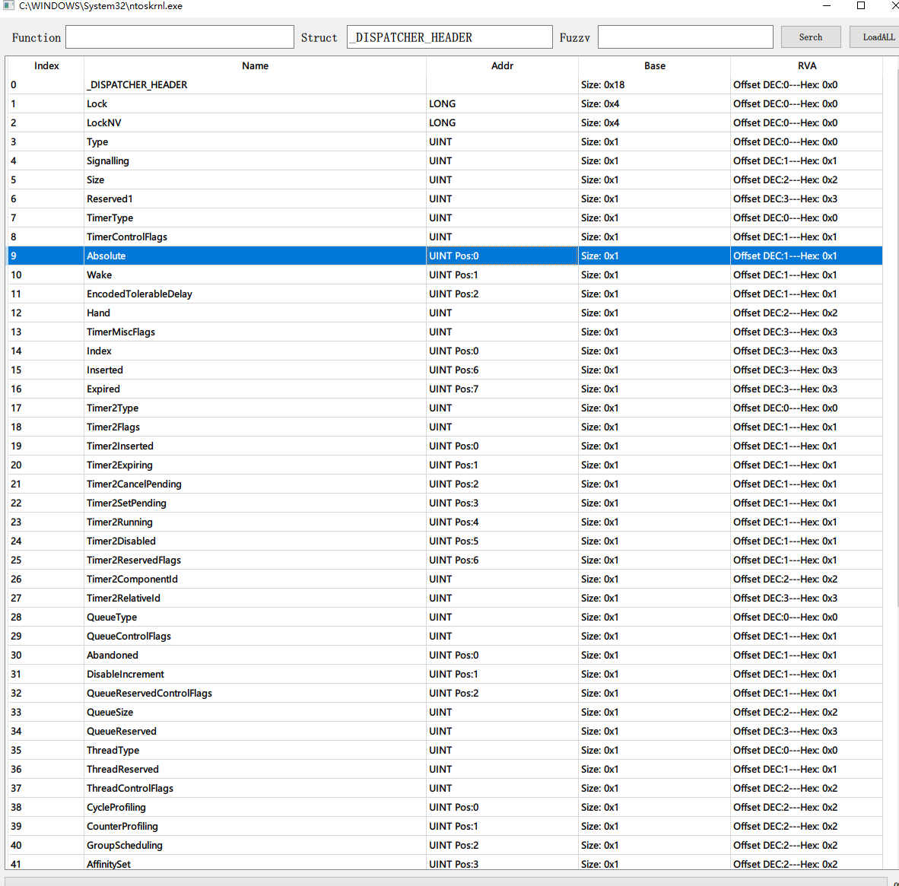
	 
	 
</h1>

###### PDB浏览器支持模糊查询 支持函数和结构体的搜索 支持名称查地址 新版本修复了偏移等显示错误 加入了类型显示 同时把窗口标题改成了对应的PE文件名 免得一头雾水

<h1 align="center">
	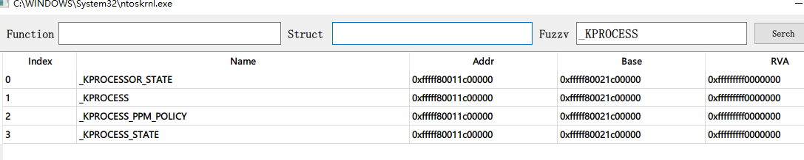
	 
	 
</h1>

###### 2-7 修复了对wow64的模块查看错误 wow64注入目前只有r3map和r0map可用(神话给的代码太复杂

##### 我不在意GDT和IDT到底有没有被修改 也不想重复process hacker已经有的功能 更不在乎某个进程连接了哪个IP

##### 重点关注进程 内存 线程 内核等重灾区 大多ARK为了功能足够多舍弃了一些不好维护或添加或不够稳定的功能 

##### 添加其他ARK等没有的更加激进功能成为主要方向(虚表钩子 指针替换扫描 IOCTL检查 回调钩子检查 虚拟化环境检查 进程断链检查 驱动断链检查 内存加载驱动检查 未知内存扫描 安全dump 更多并且更加强硬的注入方式 模仿反作弊或仿真检查 ....)

##### 在不加载PDB以及不加载驱动的情况下 保障一些基础功能的正常使用和运行 尽可能提供不依赖以上两样的最大支持

### v1.0版本已在1809 21h1 21h2上通过单元测试

#### 已完成(应用层):

##### ---进程 线程 模块 内核驱动枚举列表

##### ---文件内存代码段对比(hook扫描)

<h1 align="center">
	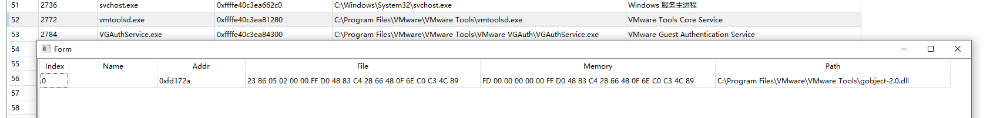
	 
	 
</h1>

###### -----如果驱动没有加载 单纯的应用层扫描 如果驱动已经加载 通过内核获取PEB链表得到模块列表 再利用内核读写内存来读取进程 最后应用层读取文件对比

##### ---应用层虚拟化检测(包括但不限于各类虚拟机以及虚拟化框架及驱动)

<h1 align="center">
	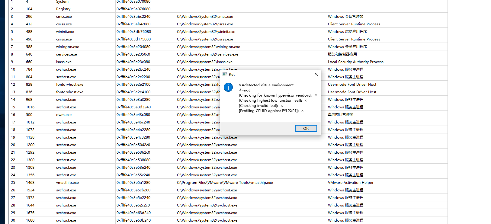
	 
	 
</h1>

##### ---符号文件查询 下载 浏览(内核驱动和应用层DLL可直接显示加载地址)和传递内核使用

<h1 align="center">
	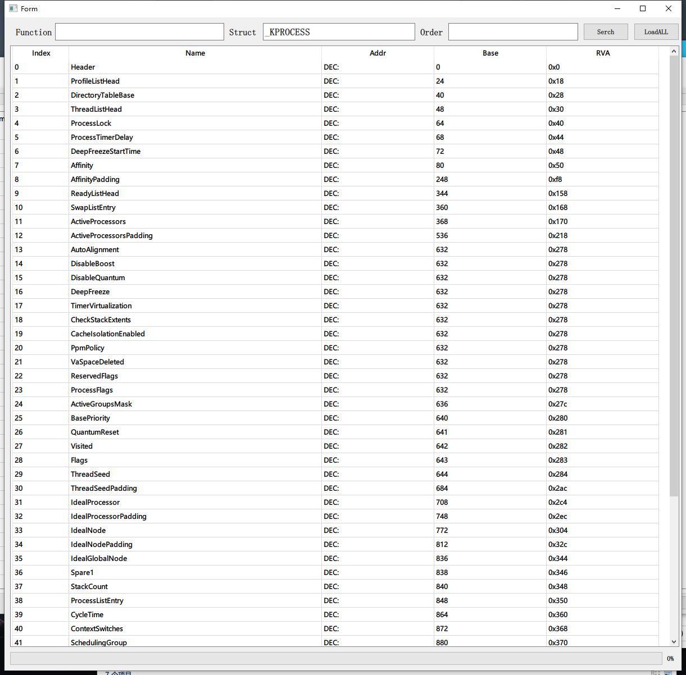
	 
	 
</h1>

<h1 align="center">
	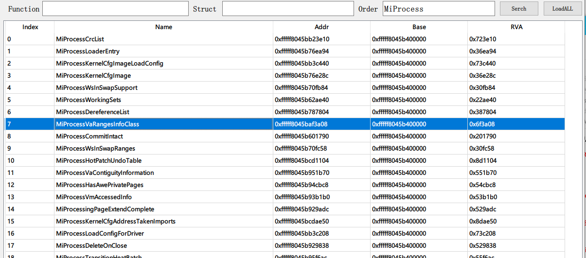
	 
	 
</h1>

<h1 align="center">
	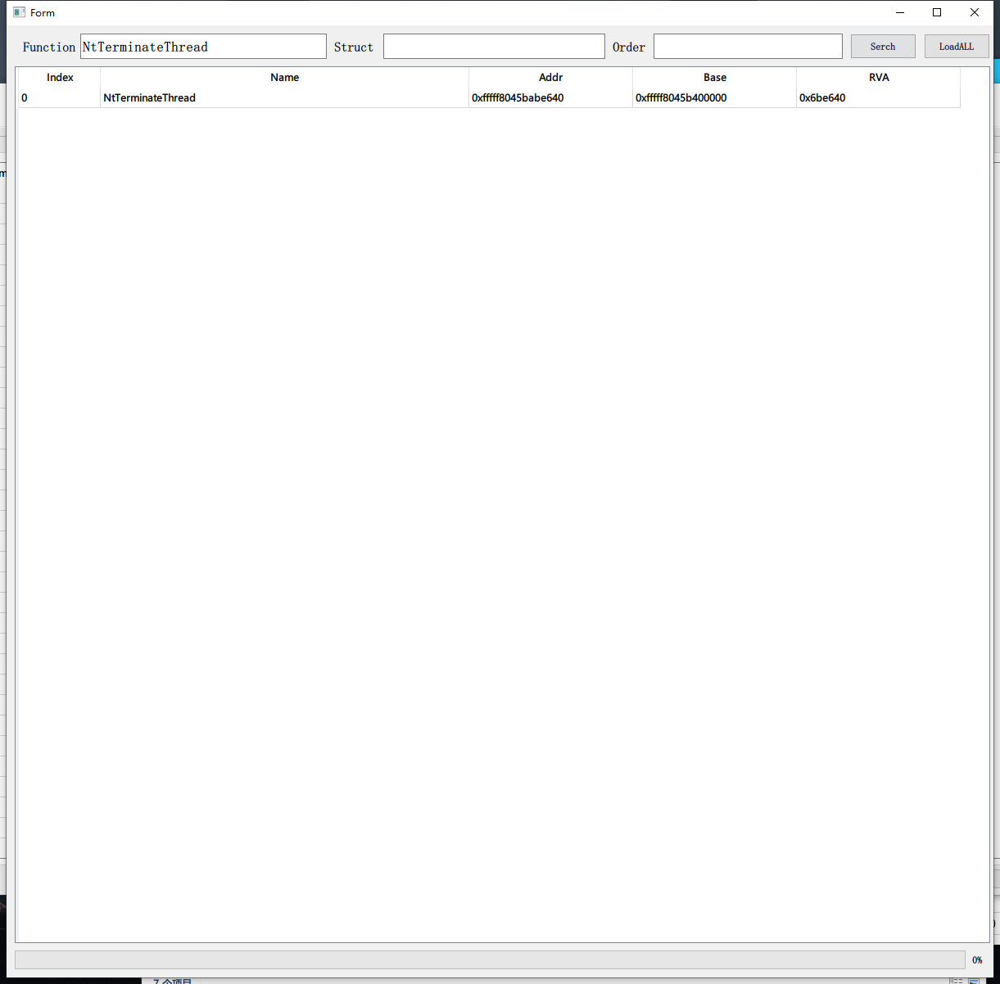
	 
	 
</h1>

##### 使用全局变量路径 可选的https://github.com/szdyg/pdb_proxy 代理下载

<h1 align="center">
	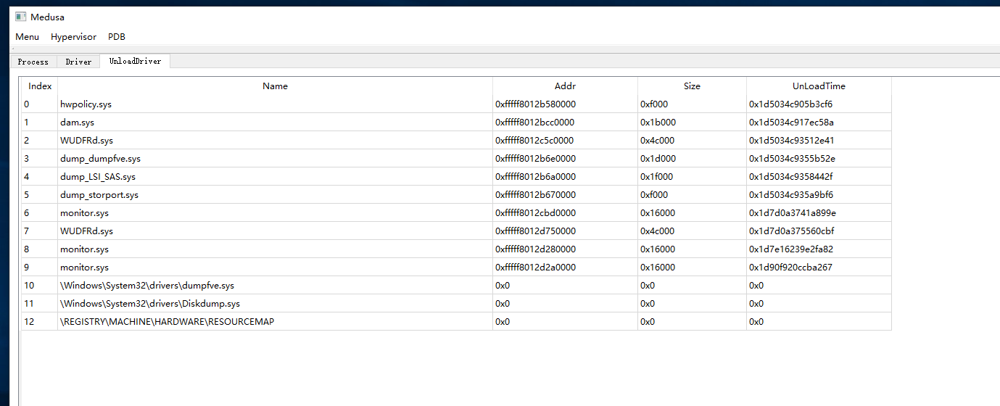
	 
	 
</h1>

#### 已完成(内核部分):

##### ---进程断链检查 一共4次检查 4次结果汇总 第三次以ObjectTable不为空为标志 第四次即便ObjectTable不为空也依旧加入列表并且标红 4次检查以后绝大部分进程断链方式都会被筛查出

###### -----应用层枚举第一次

###### -----内核调用ZwQuerySystemInformation枚举第二次

###### -----内核调用PsLookupProcessByProcessId枚举进程ID第三次检查

###### -----内核调用PsLookupThreadByThreadId枚举线程ID第四次检查

<h1 align="center">
	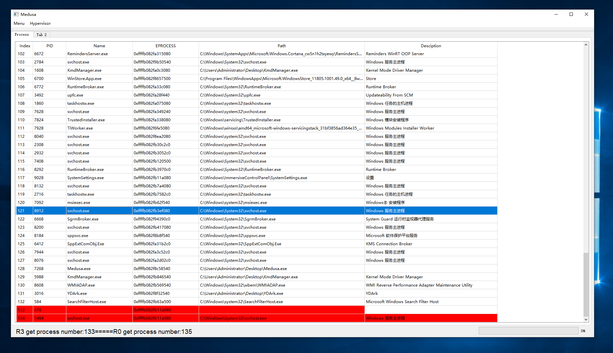
	 
	 
</h1>

##### ---驱动断链检查

<h1 align="center">
	
	 
	 
</h1>

##### ---已卸载驱动查询

<h1 align="center">
	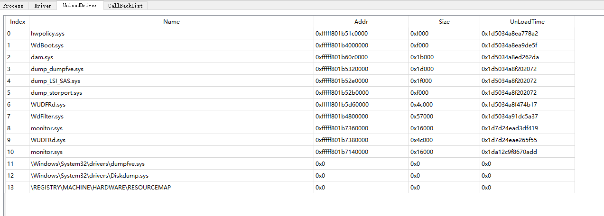
	 
	 
</h1>

##### ---进程隐藏

##### ---驱动隐藏

##### ---已卸载驱动和未卸载驱动加载信息清理

##### ---进程模块检查

###### -----应用层枚举第一次

###### -----PEB链表枚举第二次

###### -----

##### ---线程列表检查

##### ---线程栈回潮查看 依赖PDB 用内核APC和直接拷贝内存的方式搜索栈

<h1 align="center">
	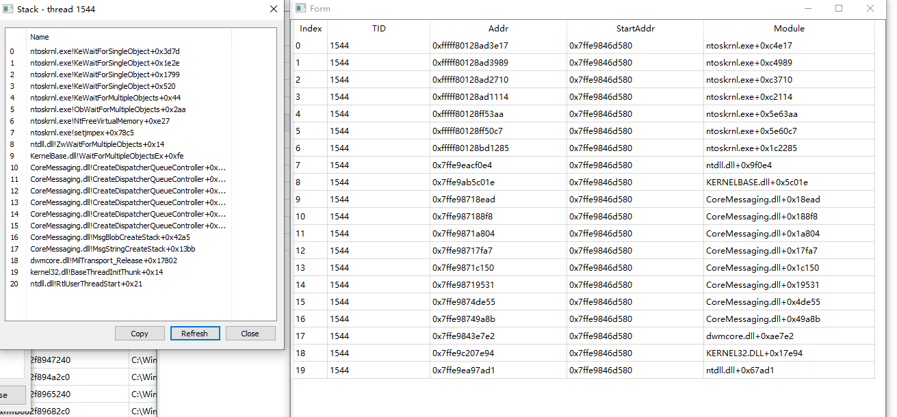
	 
	 
</h1>

##### 代码开源 已有代码的情况下我只缝合 基础功能齐全后上传release

##### 群:729338597